# 01 App Map

High-level map of the current OrchardLog / Sadownik+ application.

## Mermaid source

```mermaid
flowchart TD
  User["User"] --> Root["/"]
  Root -->|no session| Login["/login"]
  Root -->|session, no profile| BootstrapError["/bootstrap-error"]
  Root -->|session, no active orchard| Onboarding["/orchards/new"]
  Root -->|super_admin without orchard| Profile["/settings/profile"]
  Root -->|active orchard| Dashboard["/dashboard"]

  Login --> AuthShell["(auth) AuthLayout"]
  Register["/register"] --> AuthShell
  ResetPassword["/reset-password"] --> AuthShell

  Onboarding --> OnboardingLayout["(onboarding) OnboardingLayout"]
  Dashboard --> AppShell["(app) ProtectedAppShell"]
  Profile --> AccountShell["(account) AccountShell"]

  AppShell --> Plots["Plots module"]
  AppShell --> Varieties["Varieties module"]
  AppShell --> Trees["Trees module"]
  AppShell --> Activities["Activities module"]
  AppShell --> Harvests["Harvests module"]
  AppShell --> Reports["Reports module"]
  AppShell --> OrchardSettings["Orchard settings"]

  Plots --> PlotList["/plots"]
  Plots --> PlotCreate["/plots/new"]
  Plots --> PlotDetail["/plots/[plotId]"]
  Plots --> PlotEdit["/plots/[plotId]/edit"]
  PlotDetail --> PVO["Plot Visual Overview"]

  Varieties --> VarietyList["/varieties"]
  Varieties --> VarietyCreate["/varieties/new"]
  Varieties --> VarietyEdit["/varieties/[varietyId]/edit"]
  Varieties --> VarietyLocations["/reports/variety-locations"]

  Trees --> TreeList["/trees"]
  Trees --> TreeCreate["/trees/new"]
  Trees --> TreeEdit["/trees/[treeId]/edit"]
  Trees --> BatchCreate["/trees/batch/new"]
  Trees --> BulkDeactivate["/trees/batch/deactivate"]

  Activities --> ActivityList["/activities"]
  Activities --> ActivityCreate["/activities/new"]
  Activities --> ActivityDetail["/activities/[activityId]"]
  Activities --> ActivityEdit["/activities/[activityId]/edit"]

  Harvests --> HarvestList["/harvests"]
  Harvests --> HarvestCreate["/harvests/new"]
  Harvests --> HarvestDetail["/harvests/[harvestRecordId]"]
  Harvests --> HarvestEdit["/harvests/[harvestRecordId]/edit"]

  Reports --> SeasonSummary["/reports/season-summary"]
  Reports --> HarvestLocations["/reports/harvest-locations"]
  Reports --> VarietyLocations

  OrchardSettings --> OrchardConfig["/settings/orchard"]
  OrchardSettings --> Members["/settings/members"]
  AccountShell --> Profile
  AccountShell --> Export["GET /settings/profile/export"]

  Sync["GET /auth/sync-active-orchard"] -. cookie sync .-> Root
```

## Explanation

The app is a Next.js App Router application with route groups for auth, onboarding, protected orchard work, and account-level settings. The root route is a decision route, not a landing page. It resolves session/profile/orchard state and redirects to the correct working area.

The main operational shell is `ProtectedAppShell`. It exposes navigation to plots, varieties, trees, activities, harvests, reports, and owner-only orchard settings. Account settings live in a separate `AccountShell` because profile and account export are account-scoped rather than active-orchard-scoped.

`/plots/[plotId]` is implemented in current code and hosts the Plot Visual Operations screen.

## Repository references

- `app/page.tsx`
- `app/(auth)/layout.tsx`
- `app/(onboarding)/layout.tsx`
- `app/(app)/layout.tsx`
- `app/(account)/layout.tsx`
- `components/layouts/protected-app-shell.tsx`
- `components/layouts/account-shell.tsx`
- `app/auth/sync-active-orchard/route.ts`
- `app/(app)/plots/[plotId]/page.tsx`
- `features/plots/plot-visual-overview.tsx`
