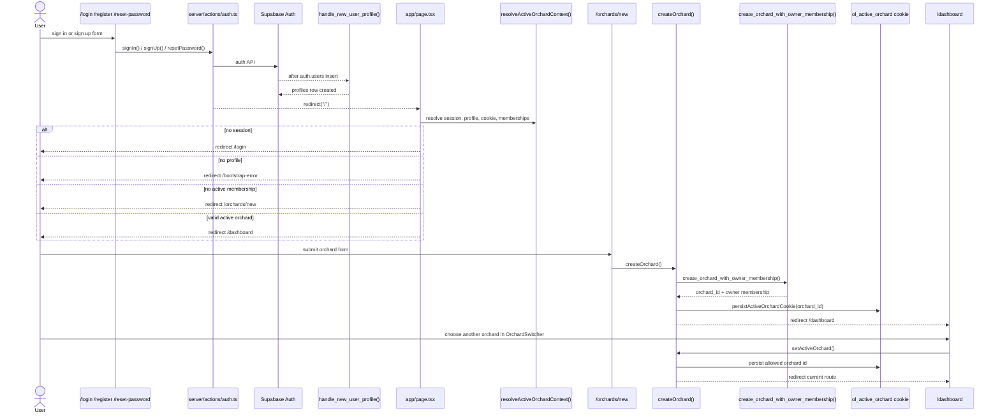

# 02 Auth And Onboarding Flow

Login, registration, first orchard creation, and orchard selection.

## Mermaid source

## Explanation

Auth is handled through Supabase Auth from server actions. A database trigger creates `profiles` after a new `auth.users` row. The app does not continue into operational pages unless `resolveActiveOrchardContext()` can resolve a session, profile, accessible orchard, and active membership.

First orchard creation is atomic through `create_orchard_with_owner_membership()`. The server action then persists `ol_active_orchard` as an `httpOnly` cookie and redirects to `/dashboard`.

Orchard selection does not mutate domain ownership. `setActiveOrchard()` verifies that the selected orchard is accessible to the user, persists only the session cookie, revalidates the app layout, and returns to the current route.

## Repository references

- `features/auth/login-form.tsx`
- `features/auth/register-form.tsx`
- `features/auth/reset-password-form.tsx`
- `server/actions/auth.ts`
- `supabase/migrations/002_create_profiles.sql`
- `app/page.tsx`
- `lib/orchard-context/resolve-active-orchard.ts`
- `app/(onboarding)/orchards/new/page.tsx`
- `server/actions/orchards.ts`
- `supabase/migrations/015_create_orchard_with_owner_membership_rpc.sql`
- `features/orchards/orchard-switcher.tsx`
