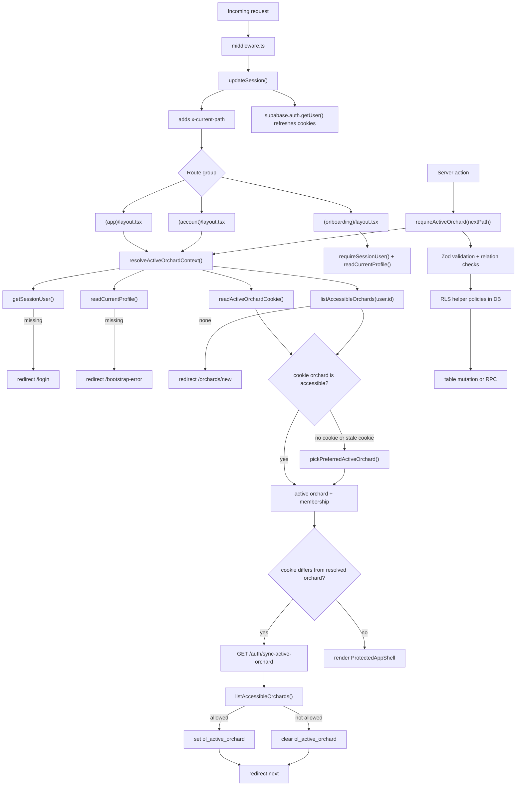

# 03 Orchard Context Flow

Active orchard resolution, cookie synchronization, middleware, server actions, and permissions.

## Mermaid source

## Explanation

The app uses middleware to keep Supabase SSR session cookies fresh and to pass the current route in `x-current-path`. The active orchard is resolved on the server, not trusted from client state. The cookie is only a preferred orchard hint and is reconciled against active memberships.

If the cookie is missing or stale, the app picks a preferred accessible orchard and redirects through `/auth/sync-active-orchard` so the `httpOnly` cookie can be set or cleared safely. Server actions call `requireActiveOrchard()` and then perform Zod validation, relation checks, and Supabase writes guarded by RLS and database functions.

## Repository references

- `middleware.ts`
- `lib/supabase/middleware.ts`
- `app/(app)/layout.tsx`
- `app/(account)/layout.tsx`
- `app/(onboarding)/layout.tsx`
- `lib/orchard-context/resolve-active-orchard.ts`
- `lib/orchard-context/active-orchard-cookie.ts`
- `lib/orchard-context/list-accessible-orchards.ts`
- `lib/orchard-context/require-active-orchard.ts`
- `app/auth/sync-active-orchard/route.ts`
- `server/actions/plots.ts`
- `server/actions/activities.ts`
- `server/actions/harvests.ts`
- `server/actions/trees.ts`
