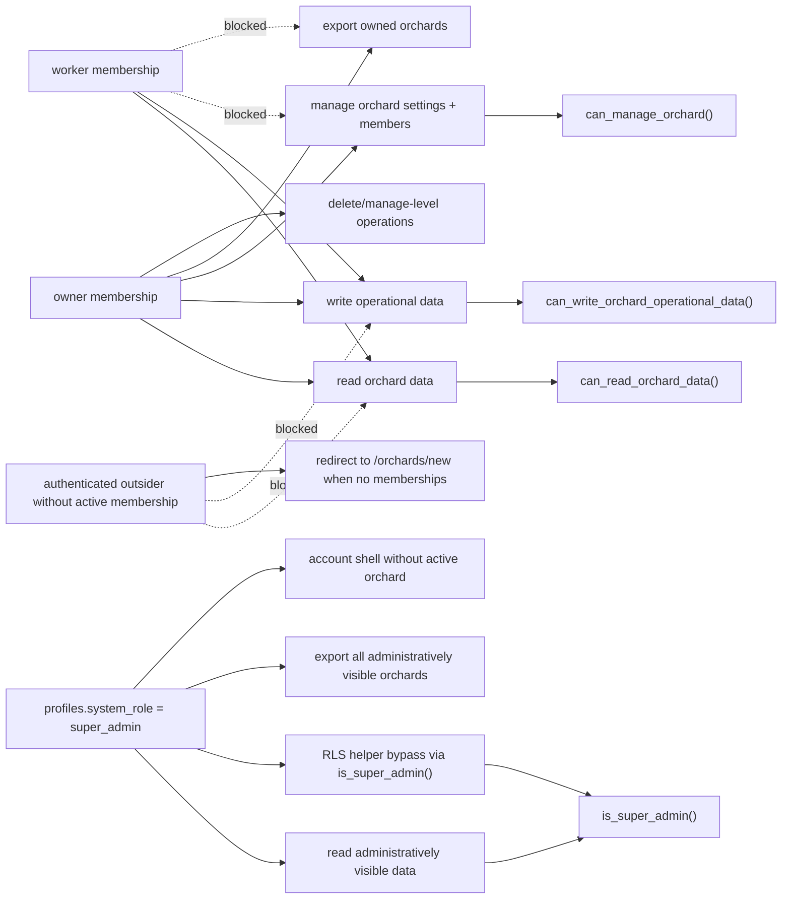

# 04 Roles Permissions

Current role model for `owner`, `worker`, `super_admin`, and outsider.

## Mermaid source

## Explanation

The product uses two role dimensions:

- global `profiles.system_role`: currently `user` or `super_admin`;
- orchard membership role: `owner`, `worker`, `manager`, `viewer`.

Current UI and tests focus on `owner`, `worker`, `super_admin`, and outsider. `manager` and `viewer` are present in schema/type checks, but they are future-ready and not product-complete flows in current code.

`owner` can read and write operational data, manage orchard settings, invite/revoke members, and export data for owned orchards. `worker` can read and write operational orchard data, including activities, harvests, plots, varieties, trees, batch create, and bulk deactivate, but cannot manage members or export account data. `super_admin` is detected through `profiles.system_role` and gets administrative visibility through RLS helper functions. An outsider has no active membership and is denied orchard data by RLS.

## Repository references

- `types/contracts.ts`
- `components/layouts/protected-app-shell.tsx`
- `components/layouts/account-shell.tsx`
- `app/(app)/settings/orchard/page.tsx`
- `app/(app)/settings/members/page.tsx`
- `server/actions/orchards.ts`
- `lib/orchard-data/export.ts`
- `supabase/migrations/012_add_core_integrity_and_rls_helpers.sql`
- `supabase/migrations/013_create_v1_security_helpers.sql`
- `supabase/migrations/014_enable_rls_and_v1_policies.sql`
- `tests/security/orchard-rls.spec.ts`
- `tests/e2e/orchard-access.spec.ts`
