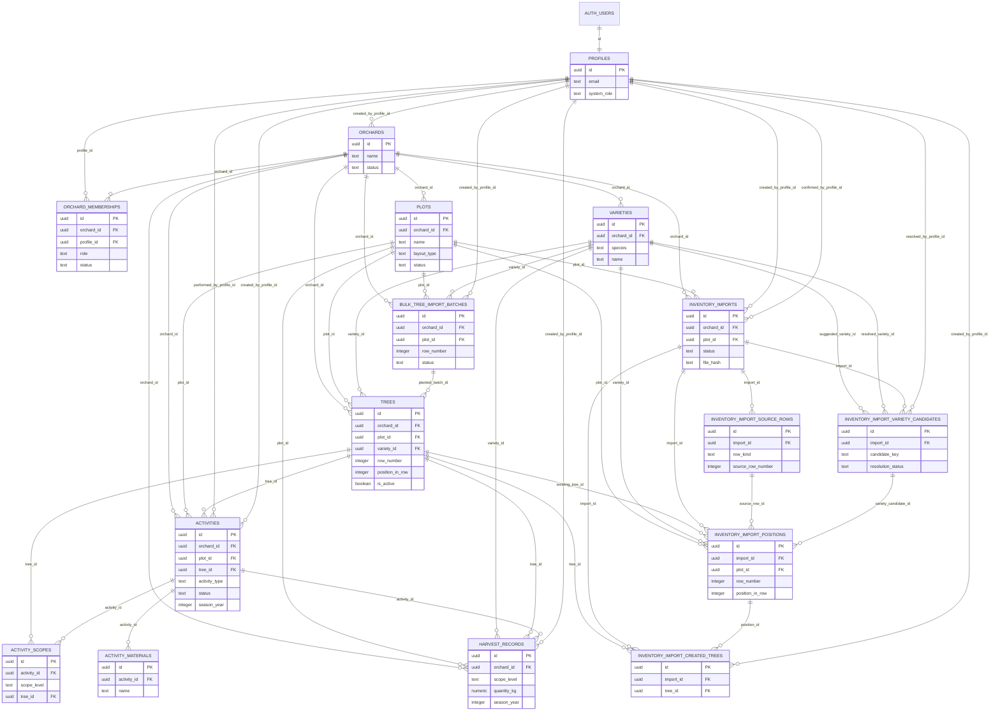

# 05 Database Domain Map

Main domain entities, relationships, and cardinalities.

## Mermaid source

## Explanation

`orchard` is the business ownership container. Most operational tables carry `orchard_id` directly. `activity_scopes` and `activity_materials` inherit ownership through their parent `activities`.

Tree Inventory staging is plot-scoped through `inventory_imports`. Source rows,
variety candidates, positions and created-tree audit rows inherit orchard access
through the parent import, with database triggers enforcing cross-orchard
references for plot, variety and tree links.

Important integrity details:

- `profiles.id` equals `auth.users.id`.
- `orchard_memberships` links profiles to orchards and defines orchard role/status.
- `trees` belongs to one `plot` and optionally one `variety`.
- `activities` belongs to one `plot`, optionally one parent `tree`, and can have many `activity_scopes` and `activity_materials`.
- `harvest_records` can be orchard, plot, variety, location_range, or tree scoped and may optionally link to a harvest-type `activity`.
- `bulk_tree_import_batches` is an operational batch entity already present in the current schema.

## Repository references

- `supabase/migrations/002_create_profiles.sql`
- `supabase/migrations/003_create_orchards.sql`
- `supabase/migrations/004_create_orchard_memberships.sql`
- `supabase/migrations/005_create_plots.sql`
- `supabase/migrations/006_create_varieties.sql`
- `supabase/migrations/007_create_trees.sql`
- `supabase/migrations/008_create_activities.sql`
- `supabase/migrations/009_create_activity_scopes.sql`
- `supabase/migrations/010_create_activity_materials.sql`
- `supabase/migrations/011_create_harvest_records.sql`
- `supabase/migrations/023_create_tree_batch_tools.sql`
- `supabase/migrations/024_extend_plots_with_layout_settings.sql`
- `types/contracts.ts`
