# 06 UI Routes Map

All current App Router pages, layouts, protected areas, public areas, and route handlers.

## Mermaid source

```mermaid
flowchart TD
  RootLayout["app/layout.tsx"] --> Root["/"]
  RootLayout --> Bootstrap["/bootstrap-error"]
  RootLayout --> AuthGroup["(auth) layout"]
  RootLayout --> OnboardingGroup["(onboarding) layout"]
  RootLayout --> AppGroup["(app) layout"]
  RootLayout --> AccountGroup["(account) layout"]
  RootLayout --> RouteHandlers["route handlers"]

  AuthGroup --> Login["/login"]
  AuthGroup --> Register["/register"]
  AuthGroup --> ResetPassword["/reset-password"]

  OnboardingGroup --> NewOrchard["/orchards/new"]

  AppGroup --> Dashboard["/dashboard"]
  AppGroup --> Plots["/plots"]
  Plots --> NewPlot["/plots/new"]
  Plots --> PlotDetail["/plots/[plotId]"]
  Plots --> EditPlot["/plots/[plotId]/edit"]

  AppGroup --> Varieties["/varieties"]
  Varieties --> NewVariety["/varieties/new"]
  Varieties --> EditVariety["/varieties/[varietyId]/edit"]

  AppGroup --> Trees["/trees"]
  Trees --> NewTree["/trees/new"]
  Trees --> EditTree["/trees/[treeId]/edit"]
  Trees --> BatchNew["/trees/batch/new"]
  Trees --> BatchDeactivate["/trees/batch/deactivate"]

  AppGroup --> Activities["/activities"]
  Activities --> NewActivity["/activities/new"]
  Activities --> ActivityDetail["/activities/[activityId]"]
  Activities --> EditActivity["/activities/[activityId]/edit"]

  AppGroup --> Harvests["/harvests"]
  Harvests --> NewHarvest["/harvests/new"]
  Harvests --> HarvestDetail["/harvests/[harvestRecordId]"]
  Harvests --> EditHarvest["/harvests/[harvestRecordId]/edit"]

  AppGroup --> Reports["/reports"]
  Reports --> SeasonSummary["/reports/season-summary"]
  Reports --> HarvestLocations["/reports/harvest-locations"]
  Reports --> VarietyLocations["/reports/variety-locations"]

  AppGroup --> AppSettings["/settings"]
  AppSettings --> OrchardSettings["/settings/orchard"]
  AppSettings --> Members["/settings/members"]

  AccountGroup --> Profile["/settings/profile"]

  RouteHandlers --> Sync["GET /auth/sync-active-orchard"]
  RouteHandlers --> Export["GET /settings/profile/export"]
  RouteHandlers --> Favicon["GET /favicon.ico"]

  AuthGroup -. redirects authenticated users .-> Root
  AppGroup -. requires active orchard .-> Login
  AppGroup -. requires active orchard .-> NewOrchard
  AccountGroup -. requires session/profile .-> Login
```

## Explanation

Public-facing auth pages are under `(auth)`, but the auth layout redirects authenticated users away from them. `(onboarding)` requires a session and profile. `(app)` is fully protected by `resolveActiveOrchardContext()` and requires an active orchard membership. `(account)` requires a session and profile but can render without an active orchard for `super_admin`.

There are no implemented detail pages for `/trees/[treeId]` or `/varieties/[varietyId]`; current tree and variety dynamic routes are edit pages only. This is intentional current state, not a missing file in this map.

## Repository references

- `app/layout.tsx`
- `app/page.tsx`
- `app/(auth)/layout.tsx`
- `app/(onboarding)/layout.tsx`
- `app/(app)/layout.tsx`
- `app/(account)/layout.tsx`
- `find app -type f -name 'page.tsx'`
- `app/auth/sync-active-orchard/route.ts`
- `app/(account)/settings/profile/export/route.ts`
- `app/favicon.ico/route.ts`
