# 07 Component Dependency Map

Important React components, shared components, and feature modules.

## Mermaid source

```mermaid
flowchart TD
  Pages["app/* pages"] --> Layouts["components/layouts"]
  Pages --> FeatureModules["features/*"]
  Pages --> DataReaders["lib/orchard-data/*"]
  Pages --> Context["lib/orchard-context/*"]

  Layouts --> ProtectedAppShell["ProtectedAppShell"]
  Layouts --> AccountShell["AccountShell"]
  Layouts --> AuthShell["AuthShell"]
  ProtectedAppShell --> OrchardSwitcher["features/orchards/OrchardSwitcher"]
  ProtectedAppShell --> SignOut["signOut()"]
  AccountShell --> SignOut

  FeatureModules --> AuthFeatures["features/auth"]
  FeatureModules --> OrchardFeatures["features/orchards"]
  FeatureModules --> PlotFeatures["features/plots"]
  FeatureModules --> TreeFeatures["features/trees"]
  FeatureModules --> VarietyFeatures["features/varieties"]
  FeatureModules --> ActivityFeatures["features/activities"]
  FeatureModules --> HarvestFeatures["features/harvests"]

  AuthFeatures --> AuthActions["server/actions/auth.ts"]
  OrchardFeatures --> OrchardActions["server/actions/orchards.ts"]
  PlotFeatures --> PlotActions["server/actions/plots.ts"]
  TreeFeatures --> TreeActions["server/actions/trees.ts"]
  VarietyFeatures --> VarietyActions["server/actions/varieties.ts"]
  ActivityFeatures --> ActivityActions["server/actions/activities.ts"]
  HarvestFeatures --> HarvestActions["server/actions/harvests.ts"]

  PlotFeatures --> PVO["PlotVisualOverview"]
  PVO --> PlotGrid["lib/domain/plot-visual-grid.ts"]
  PVO --> PlotSelection["lib/domain/plot-selection.ts"]
  PVO --> ActivityPrefill["lib/domain/activity-prefill.ts"]
  PVO --> BatchPrefill["lib/domain/tree-batch-prefill.ts"]
  PVO --> TreeDetailPanel["PlotTreeDetailPanel"]

  ActivityFeatures --> ActivityForm["ActivityForm"]
  ActivityFeatures --> ActivityList["ActivityList"]
  ActivityFeatures --> ActivitySummary["ActivitySeasonSummary"]
  HarvestFeatures --> HarvestForm["HarvestForm"]
  HarvestFeatures --> HarvestReports["HarvestSeasonSummaryView + HarvestLocationSummaryView"]
  TreeFeatures --> TreeForm["TreeForm"]
  TreeFeatures --> BulkForms["BulkTreeBatchForm + BulkTreeDeactivateForm"]

  FeatureModules --> UI["components/ui"]
  UI --> Card["Card"]
  UI --> Button["Button"]
  UI --> FormControls["Input Select Textarea Field FormMessage SubmitButton"]
  UI --> StateCards["EmptyStateCard PrerequisiteCard RecordNotFoundCard AccessDeniedCard FeedbackBanner"]

  DataReaders --> Supabase["createSupabaseServerClient()"]
  ServerActions["server/actions/*"] --> Validation["lib/validation/*"]
  ServerActions --> Context
  ServerActions --> Supabase
```

## Explanation

Pages are mostly server components that assemble data readers and feature components. Mutating feature forms are client components using server actions. Shared UI primitives live in `components/ui`, while domain-specific behavior sits in `features/*` and `lib/domain/*`.

The PVO slice is a notable client-side feature module: it receives `trees` from the server page, builds a visual grid, lets the user browse/select trees, and builds prefill links to `/activities/new`, `/trees/batch/deactivate`, and `/trees/batch/new` without performing mutations or extra server calls.

## Repository references

- `components/layouts/protected-app-shell.tsx`
- `components/layouts/account-shell.tsx`
- `components/layouts/auth-shell.tsx`
- `components/ui/*`
- `features/auth/*`
- `features/orchards/*`
- `features/plots/*`
- `features/trees/*`
- `features/varieties/*`
- `features/activities/*`
- `features/harvests/*`
- `server/actions/*`
- `lib/domain/*`
- `lib/validation/*`
- `lib/orchard-data/*`
