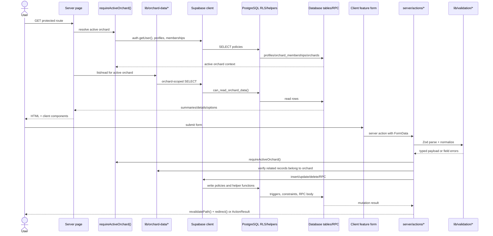

# 08 Data Flow

UI, server actions, Supabase, RLS, and database flow.

## Mermaid source

## Explanation

Reads are primarily server-side and orchard-scoped. Pages call `requireActiveOrchard()` and then data readers in `lib/orchard-data/*`. Mutations go through server actions. Server actions validate form data, verify orchard ownership of related records, and rely on Supabase RLS plus database constraints/triggers/RPC for defense-in-depth.

Complex writes use database RPC where atomicity matters:

- `create_orchard_with_owner_membership()`
- `invite_orchard_member_by_email()`
- `create_activity_with_children()`
- `update_activity_with_children()`
- `create_bulk_tree_batch()`
- `bulk_deactivate_trees()`

Query prefill flows such as `/activities/new?...` and `/trees/batch/deactivate?...` are UI conveniences. They are parsed server-side into form defaults, but actual writes still pass through the standard server action and database validation path.

## Repository references

- `lib/orchard-context/require-active-orchard.ts`
- `lib/orchard-data/*`
- `server/actions/*`
- `lib/validation/*`
- `lib/supabase/server.ts`
- `supabase/migrations/013_create_v1_security_helpers.sql`
- `supabase/migrations/014_enable_rls_and_v1_policies.sql`
- `supabase/migrations/018_create_activity_mutation_rpcs.sql`
- `supabase/migrations/023_create_tree_batch_tools.sql`
- `lib/validation/activity-prefill.ts`
- `lib/validation/tree-batch-prefill.ts`
