# 09 Testing Map

Unit tests, integration tests, security/RLS tests, Playwright tests, and known uncovered areas.

## Mermaid source

```mermaid
flowchart TD
  TestSuite["pnpm test / pnpm test:e2e"] --> Unit["tests/unit"]
  TestSuite --> Integration["tests/integration"]
  TestSuite --> Security["tests/security"]
  TestSuite --> E2E["tests/e2e"]

  Unit --> Validation["Zod validation + normalization"]
  Unit --> Domain["domain helpers"]
  Unit --> UIState["route state cards + feedback notices"]
  Unit --> PVOUnit["plot visual grid, selection, prefill"]
  Unit --> ReportsUnit["harvest and variety aggregators"]
  Unit --> ActionGuards["server action guard behavior with mocks"]

  Integration --> AuthBootstrap["profile bootstrap"]
  Integration --> OrchardCreation["create orchard + owner membership"]
  Integration --> StructureFlow["plots, varieties, trees"]
  Integration --> ActivityFlow["activities + scopes + materials"]
  Integration --> HarvestFlow["harvest records + reports"]
  Integration --> BatchFlow["tree batch create + bulk deactivate"]
  Integration --> DashboardFlow["dashboard summary"]

  Security --> RLSOrchard["orchard/profile/membership RLS"]
  Security --> RLSStructure["plots/varieties/trees RLS"]
  Security --> RLSActivities["activities/children RLS"]
  Security --> RLSHarvests["harvest_records RLS"]
  Security --> RLSBatch["bulk_tree_import_batches + RPC RLS"]

  E2E --> AuthOnboarding["auth onboarding"]
  E2E --> OrchardAccess["orchard switch, worker/export restrictions, outsider"]
  E2E --> OwnerOperational["owner operational flow"]
  E2E --> BatchExport["tree batch + export"]
  E2E --> PlotVisualOps["plot visual operations"]

  Gaps["Known gaps / future coverage"] --> TreeDetail["tree detail page not implemented"]
  Gaps --> VarietyDetail["variety detail page not implemented"]
  Gaps --> AcceptInvite["accept invitation flow not implemented"]
  Gaps --> Attachments["storage/attachments not implemented"]
```

## Explanation

The test suite is split by confidence layer:

- `tests/unit` covers pure validation, domain helpers, route state UI, and mocked guard behavior.
- `tests/integration` uses the local Supabase database for server/data flows and read models.
- `tests/security` directly verifies RLS and permission isolation.
- `tests/e2e` covers browser-level user flows with Playwright.

Current operational commands are defined in `package.json`: `pnpm test`, `pnpm test:e2e`, `pnpm seed:baseline-reset`, and `pnpm qa:baseline-status`. E2E and integration tests mutate local data, so the documented workflow resets baseline before manual QA.

## Repository references

- `package.json`
- `vitest.config.ts`
- `playwright.config.ts`
- `tests/unit/*`
- `tests/integration/*`
- `tests/security/*`
- `tests/e2e/*`
- `tests/e2e/support/*`
- `documents/07_security_and_quality/test_plan.md`
- `scripts/reset-and-seed-baseline.mjs`
- `scripts/check-baseline-qa-status.mjs`
