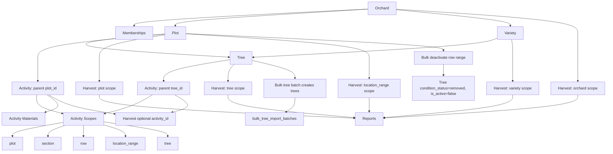

# 10 Orchard Business Flow

Business relationships from Orchard to Plot, Tree, Activity, and Harvest.

## Mermaid source

## Explanation

`Orchard` is the top-level business container. `Plot` is the physical working area, `Tree` is the physical object, and `Variety` is a reusable orchard-local classification attached to trees and harvest records.

Activities are operational log entries. A parent `activities.tree_id` is used for a single-tree activity, while `activity_scopes` stores detailed work coverage for plot, section, row, location range, or tree scopes. Materials are children of activities.

Harvest records are quantitative records and can be scoped to orchard, plot, variety, location range, or tree. They may optionally link to an `activity` of type `harvest`, but harvest data is stored in `harvest_records`, not only in activities.

## Repository references

- `types/contracts.ts`
- `supabase/migrations/005_create_plots.sql`
- `supabase/migrations/006_create_varieties.sql`
- `supabase/migrations/007_create_trees.sql`
- `supabase/migrations/008_create_activities.sql`
- `supabase/migrations/009_create_activity_scopes.sql`
- `supabase/migrations/010_create_activity_materials.sql`
- `supabase/migrations/011_create_harvest_records.sql`
- `supabase/migrations/023_create_tree_batch_tools.sql`
- `server/actions/activities.ts`
- `server/actions/harvests.ts`
- `server/actions/trees.ts`
