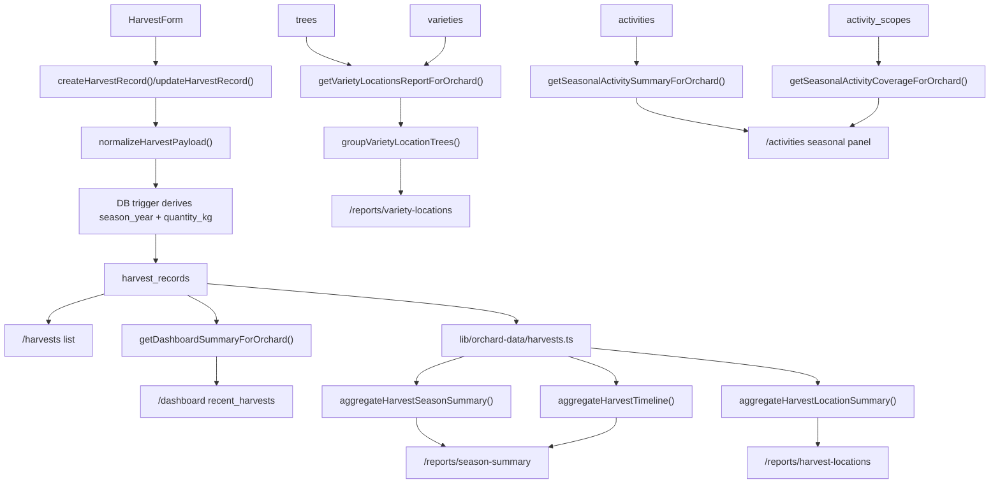

# 11 Reporting Flow

Harvest records, aggregations, reports, and dashboards.

## Mermaid source

## Explanation

Harvest reporting starts with `harvest_records`. The app stores both original quantity and normalized `quantity_kg`, and reports aggregate by normalized kilograms. Current report aggregation is implemented in TypeScript domain helpers, not in database materialized views.

`/reports/season-summary` combines season totals and timeline. `/reports/harvest-locations` groups harvest records by field location and has a fallback for tree-scoped records. The dashboard reads recent harvests directly from `harvest_records`.

`/reports/variety-locations` is related reporting, but it is based on active `trees` for a selected `variety`, not on `harvest_records`. `/activities` has its own seasonal operational summary and coverage based on `activities` and `activity_scopes`.

## Repository references

- `features/harvests/harvest-form.tsx`
- `server/actions/harvests.ts`
- `lib/validation/harvests.ts`
- `lib/orchard-data/harvests.ts`
- `lib/domain/harvests.ts`
- `app/(app)/harvests/page.tsx`
- `app/(app)/reports/season-summary/page.tsx`
- `app/(app)/reports/harvest-locations/page.tsx`
- `lib/orchard-data/dashboard.ts`
- `app/(app)/dashboard/page.tsx`
- `lib/orchard-data/varieties.ts`
- `lib/domain/variety-locations.ts`
- `app/(app)/reports/variety-locations/page.tsx`
