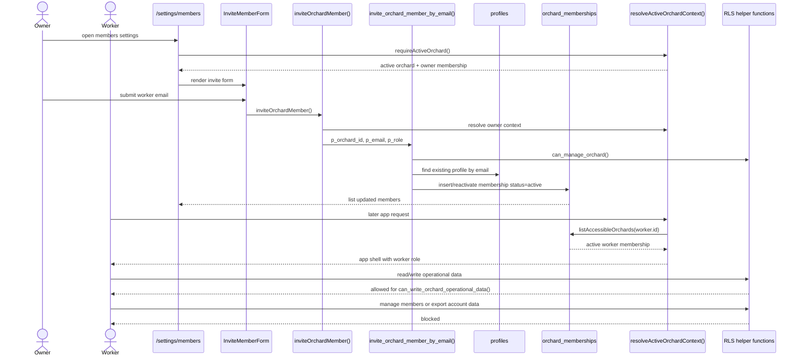

# 12 Membership Flow

Owner invite worker, invitation state, membership, and permission checks.

## Mermaid source

## Explanation

Current code supports owner-managed membership for existing accounts. The owner opens `/settings/members`, submits an email, and `invite_orchard_member_by_email()` finds the existing `profile` and inserts or reactivates an `orchard_memberships` row.

Important current-state note: there is no implemented Accept Invitation route/action in the repository. Although the database status enum includes `invited`, the current RPC sets membership `status = 'active'` immediately. In diagrams and implementation planning, any true accept-invitation flow should be treated as future work unless new code is added.

Permission checks happen at multiple layers:

- UI hides member settings for non-owners.
- Server actions check `context.membership.role === "owner"` before management mutations.
- RLS helper functions enforce read/write/manage permissions in the database.

## Repository references

- `app/(app)/settings/members/page.tsx`
- `features/orchards/invite-member-form.tsx`
- `features/orchards/member-list.tsx`
- `server/actions/orchards.ts`
- `supabase/migrations/004_create_orchard_memberships.sql`
- `supabase/migrations/016_create_invite_orchard_member_rpc.sql`
- `supabase/migrations/013_create_v1_security_helpers.sql`
- `supabase/migrations/014_enable_rls_and_v1_policies.sql`
- `tests/integration/orchard-management-flow.spec.ts`
- `tests/security/orchard-management-rls.spec.ts`
