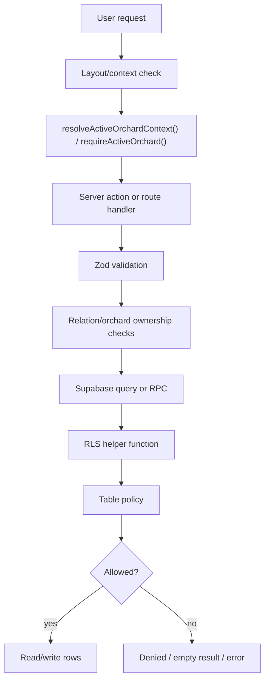

# 13 RLS Policy Matrix

Supabase RLS, helper functions, roles, and tests for orchard-scoped data.

## Sources Inspected

- `supabase/migrations/*.sql`
- `types/contracts.ts`
- `app/(app)/layout.tsx`
- `app/(account)/layout.tsx`
- `lib/orchard-context/*`
- `server/actions/*`
- `tests/security/*`
- `tests/integration/*`
- `tests/e2e/orchard-access.spec.ts`

`documents/archive/` was not used as source of truth.

## Overview

Authorization is layered. The UI and layouts guide users into the right area,
but the database remains the final enforcement layer.

| Layer | Responsibility | Source files |
| ----- | -------------- | ------------ |
| UI/layout checks | Redirect unauthenticated users, require active orchard for `(app)`, show owner-only settings where appropriate | `app/(app)/layout.tsx`, `app/(account)/layout.tsx`, `components/layouts/protected-app-shell.tsx` |
| Server action checks | Require session or active orchard, validate owner-only mutations, normalize redirects | `server/actions/*`, `lib/orchard-context/require-active-orchard.ts` |
| Validation and relation checks | Parse form data, verify related records belong to active orchard before writes | `lib/validation/*`, `lib/orchard-data/*`, `lib/domain/*` |
| Supabase RLS | Enforce table-level read/write/delete boundaries for authenticated users | `supabase/migrations/014_enable_rls_and_v1_policies.sql`, follow-up hardening migrations |
| Helper functions | Centralize membership, owner, worker and `super_admin` predicates | `supabase/migrations/012_add_core_integrity_and_rls_helpers.sql`, `013_create_v1_security_helpers.sql` |
| RPC/security-definer functions | Keep multi-row mutations atomic while checking auth and orchard permissions | `015_create_orchard_with_owner_membership_rpc.sql`, `016_create_invite_orchard_member_rpc.sql`, `018_create_activity_mutation_rpcs.sql`, `023_create_tree_batch_tools.sql` |
| Security tests | Verify RLS isolation for owner, worker, outsider and child rows | `tests/security/*` |

## Role Model

| Role | Meaning | Source of truth | Notes |
| ---- | ------- | --------------- | ----- |
| unauthenticated | No Supabase session | Supabase Auth, `getSessionUser()`, route handlers | Redirected to `/login`; RLS policies are `to authenticated`, so direct table access is unavailable. |
| authenticated outsider | Signed in profile with no active membership for a target orchard | `orchard_memberships`, `resolveActiveOrchardContext()` | Redirected to onboarding when no accessible orchards; RLS denies foreign orchard data. |
| `worker` | Active orchard member allowed to perform operational work | `types/contracts.ts`, `orchard_memberships.role`, `can_write_orchard_operational_data()` | Can read/write operational data; cannot manage members or owner-only export. |
| `owner` | Active orchard member with management rights | `orchard_memberships.role`, `can_manage_orchard()` | Can manage orchard settings/members and export owned orchards. |
| `super_admin` | Global system role on profile | `profiles.system_role`, `is_super_admin()` | RLS helper bypass for visible/admin data; account shell can render without active orchard. |
| `manager` | Schema/type-level membership role | `types/contracts.ts`, `orchard_memberships.role` check | Present in schema/types and invite RPC validation, but not product-complete in current UI/tests. |
| `viewer` | Schema/type-level membership role | `types/contracts.ts`, `orchard_memberships.role` check | Present in schema/types and invite RPC validation, but not product-complete in current UI/tests. |

## RLS Helper Function Map

| Helper/function | Purpose | Used by policies/RPCs | Important notes |
| --------------- | ------- | --------------------- | --------------- |
| `is_super_admin()` | Checks whether `auth.uid()` profile has `system_role = 'super_admin'` | Profile/orchard policies, security helpers | `security definer`; granted to `authenticated`. |
| `is_active_orchard_member(uuid)` | Checks active membership in target orchard | `can_read_orchard_data()` | Ignores `invited` and `revoked` memberships. |
| `has_orchard_role(uuid, text[])` | Checks active membership with allowed roles | `is_orchard_owner()`, `can_write_orchard_operational_data()` | Role-based helper; current product mainly uses `owner` and `worker`. |
| `is_orchard_owner(uuid)` | Checks active owner membership | `can_manage_orchard()` | Wraps `has_orchard_role(..., ['owner'])`. |
| `can_read_profile(uuid)` | Allows own profile, same-orchard visible profile, or `super_admin` | `profiles_select_visible_profiles` | Lets owners read worker profile data in shared orchards. |
| `can_read_orchard_data(uuid)` | Allows active member or `super_admin` to read orchard-scoped data | Most SELECT policies | Core read helper for operational tables. |
| `can_write_orchard_operational_data(uuid)` | Allows `owner`, `worker`, or `super_admin` operational writes | Operational INSERT/UPDATE/DELETE policies, activity/batch RPCs | Does not include `manager/viewer` despite schema roles. |
| `can_manage_orchard(uuid)` | Allows owner or `super_admin` management operations | Orchard/member management policies and invite RPC | Used for settings, membership changes and manage-level deletes. |
| `can_bootstrap_orchard_owner(uuid, uuid, text, text)` | Allows first owner membership for newly created orchard | `orchard_memberships_insert_bootstrap_or_manage` | Requires target profile to equal `auth.uid()`, role `owner`, status `active`, and no existing memberships. |
| `can_read_activity_children(uuid)` | Allows child-row reads through parent `activities.orchard_id` | `activity_scopes` and `activity_materials` SELECT policies | Child rows do not carry direct `orchard_id`. |
| `can_write_activity_children(uuid)` | Allows child-row writes through parent `activities.orchard_id` | `activity_scopes` and `activity_materials` write policies | Protects scope/material mutations through parent access. |
| `guard_profile_self_service_update()` | Prevents non-admin edits to immutable/profile-sensitive fields | `profiles` update trigger | Blocks profile `id`, `email`, `system_role`, `created_at` changes unless `super_admin`. |

## Table Policy Matrix

This table reflects the effective policy set after follow-up hardening migrations
such as `019`, `020`, `021`, `022`, `029`, and `034`.

| Table | SELECT | INSERT | UPDATE | DELETE | Important helper/policy | Related tests | Notes |
| ----- | ------ | ------ | ------ | ------ | ----------------------- | ------------- | ----- |
| `profiles` | `can_read_profile(id)` | No app insert policy; profile bootstrap trigger creates rows | self or `super_admin`, plus `guard_profile_self_service_update()` | No delete policy | `profiles_select_visible_profiles`, `profiles_update_self_or_super_admin` | `orchard-rls.spec.ts`, `profile-bootstrap.spec.ts` | `profiles.id` equals `auth.users.id`. |
| `orchards` | member/creator/`super_admin` | authenticated creator or `super_admin` | owner/creator/`super_admin` | `super_admin` only | `can_read_orchard_data`, `can_manage_orchard`, `is_super_admin` | `orchard-rls.spec.ts`, `orchard-creation-flow.spec.ts` | App normally creates orchards through RPC. |
| `orchard_memberships` | own row or owner/`super_admin` managing orchard | first owner bootstrap or manage orchard | manage orchard | manage orchard | `orchard_memberships_insert_bootstrap_or_manage`, `can_bootstrap_orchard_owner`, `can_manage_orchard` | `orchard-management-rls.spec.ts`, `orchard-rls.spec.ts` | `invited` exists, but current invite RPC writes `active`. |
| `plots` | active member/`super_admin` | owner/worker/`super_admin` | owner/worker/`super_admin` | owner/`super_admin` | `can_read_orchard_data`, `can_write_orchard_operational_data`, `can_manage_orchard` | `core-orchard-structure-rls.spec.ts` | App uses archive/restore, not physical delete UI. |
| `varieties` | active member/`super_admin` | owner/worker/`super_admin` | owner/worker/`super_admin` | owner/`super_admin` | same operational helpers | `core-orchard-structure-rls.spec.ts` | No delete UI currently. |
| `trees` | active member/`super_admin` | owner/worker/`super_admin` | owner/worker/`super_admin` | owner/`super_admin` | same operational helpers | `core-orchard-structure-rls.spec.ts` | Removed trees are soft/inactive via fields and batch flow. |
| `activities` | active member/`super_admin` | owner/worker/`super_admin` | owner/worker/`super_admin` | owner/worker/`super_admin` | `can_write_orchard_operational_data` | `activity-management-rls.spec.ts` | Delete is allowed for operational writers. |
| `activity_scopes` | via parent activity read access | via parent activity write access | via parent activity write access | via parent activity write access | `can_read_activity_children`, `can_write_activity_children` | `activity-management-rls.spec.ts` | Ownership is inherited through `activities`. |
| `activity_materials` | via parent activity read access | via parent activity write access | via parent activity write access | via parent activity write access | `can_read_activity_children`, `can_write_activity_children` | `activity-management-rls.spec.ts` | Ownership is inherited through `activities`. |
| `harvest_records` | active member/`super_admin` | owner/worker/`super_admin` | owner/worker/`super_admin` | owner/worker/`super_admin` | `can_read_orchard_data`, `can_write_orchard_operational_data` | `harvest-management-rls.spec.ts` | Trigger validates scope consistency and derives `season_year`/`quantity_kg`. |
| `bulk_tree_import_batches` | active member/`super_admin` | owner/worker/`super_admin` | owner/worker/`super_admin` | owner/worker/`super_admin` | `bulk_tree_import_batches_*`, `can_write_orchard_operational_data` | `tree-batch-rls.spec.ts` | Created by `create_bulk_tree_batch()` and read by batch flows. |

## Special Cases

- Child tables `activity_scopes` and `activity_materials` do not carry direct `orchard_id`; they are protected through parent `activities`.
- `harvest_records` can be scoped to `orchard`, `plot`, `variety`, `location_range`, or `tree`. Database triggers validate cross-orchard/cross-plot mismatches and normalize quantity.
- `super_admin` is implemented through `profiles.system_role = 'super_admin'` and `is_super_admin()`. It can access account export without active orchard, but normal operational app pages still require active orchard context.
- `orchard_memberships.status` supports `invited`, `active`, and `revoked`. Active orchard resolution and RLS helper membership checks use only `active`.
- Current invite flow for existing accounts uses `invite_orchard_member_by_email()` and writes/reactivates membership as `active`; there is no true Accept Invitation route/action.
- `listAccessibleOrchards()` filters active memberships and active orchards. A stale `ol_active_orchard` cookie is cleared or replaced through `/auth/sync-active-orchard`.
- Plot archive/restore is soft status-based behavior in app flows. Tree removal is represented by `condition_status = 'removed'` and `is_active = false`.

## Mermaid Summary

## Repository References

- `supabase/migrations/012_add_core_integrity_and_rls_helpers.sql`
- `supabase/migrations/013_create_v1_security_helpers.sql`
- `supabase/migrations/014_enable_rls_and_v1_policies.sql`
- `supabase/migrations/019_consolidate_orchard_membership_insert_policy.sql`
- `supabase/migrations/020_wrap_auth_uid_in_orchard_membership_select_policy.sql`
- `supabase/migrations/021_wrap_auth_uid_in_orchards_update_policy.sql`
- `supabase/migrations/022_wrap_auth_uid_in_orchards_insert_policy.sql`
- `supabase/migrations/023_create_tree_batch_tools.sql`
- `supabase/migrations/029_wrap_auth_uid_in_orchards_select_policy.sql`
- `supabase/migrations/034_wrap_auth_uid_in_profiles_update_policy.sql`
- `types/contracts.ts`
- `tests/security/*`
