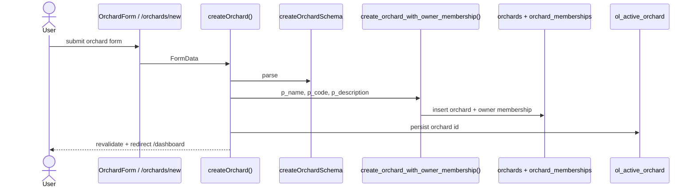
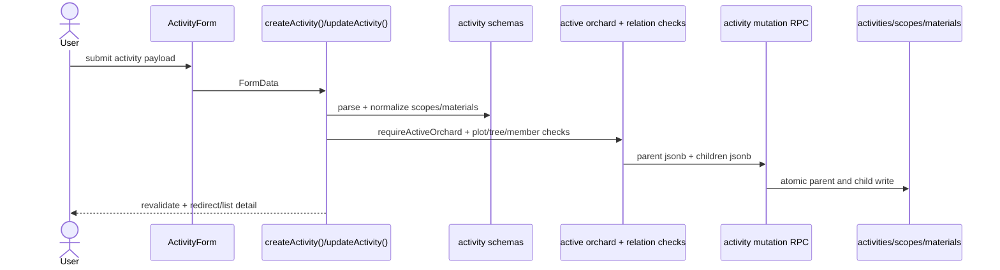
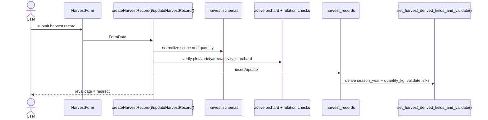
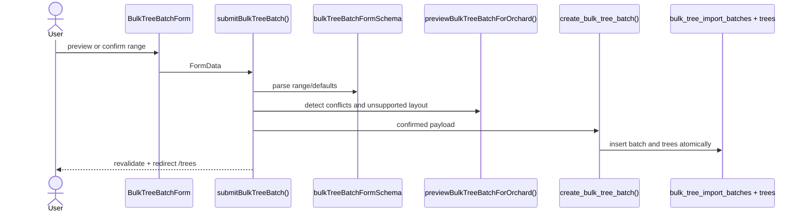
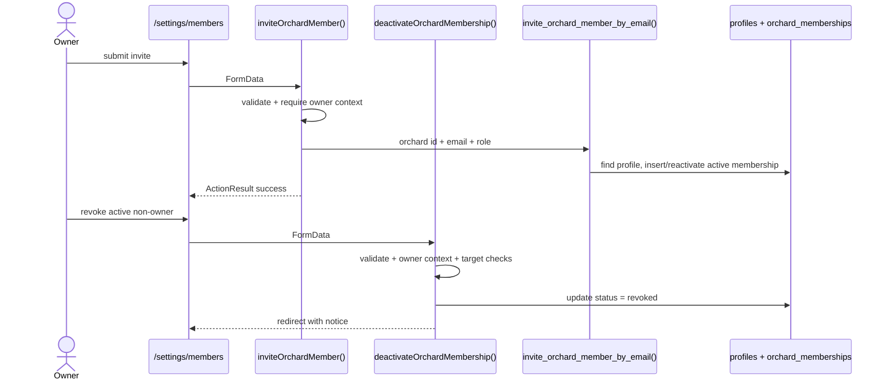
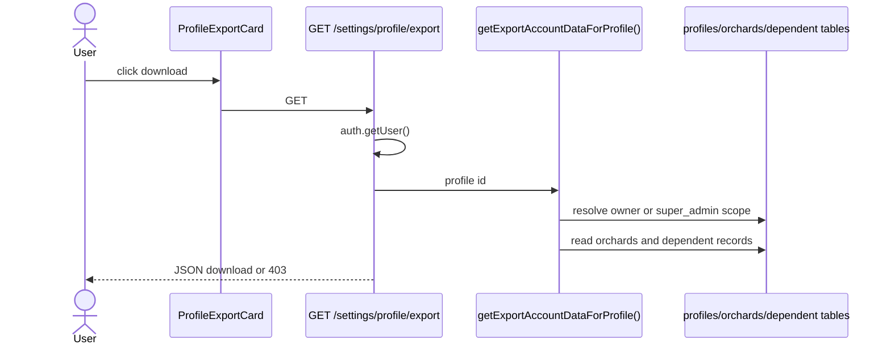

# 14 Server Actions RPC Map

How UI mutations and important reads flow through server actions, validation,
RPCs, database tables, and tests.

## Sources Inspected

- `app/`
- `features/*`
- `server/actions/*`
- `lib/validation/*`
- `lib/domain/*`
- `lib/orchard-data/*`
- `supabase/migrations/*.sql`
- `tests/unit/*`
- `tests/integration/*`
- `tests/security/*`
- `tests/e2e/*`

`documents/archive/` was not used as source of truth.

## Server Action Inventory

| Feature | UI entry point | Server action / route handler | Validation | DB tables/RPCs | Authorization checks | Tests |
| ------- | -------------- | ----------------------------- | ---------- | -------------- | -------------------- | ----- |
| Auth sign up | `/register`, `RegisterForm` | `signUp()` | `signUpSchema` | Supabase Auth, profile trigger | Supabase Auth | `auth-onboarding.spec.ts`, `profile-bootstrap.spec.ts` |
| Auth sign in | `/login`, `LoginForm` | `signIn()` | `signInSchema` | Supabase Auth | Supabase Auth | E2E helpers and auth flow |
| Reset password request | `/reset-password`, `ResetPasswordForm` | `resetPassword()` | `resetPasswordSchema` | Supabase Auth | Supabase Auth | Unit validation only; no full callback E2E found |
| Sign out | app/account shells | `signOut()` | none | Supabase Auth | session | E2E flows indirectly |
| Orchard creation | `/orchards/new`, `OrchardForm` | `createOrchard()` | `createOrchardSchema` | `create_orchard_with_owner_membership()` | `requireSessionUser()` and RPC bootstrap checks | `orchard-creation-flow.spec.ts`, `auth-onboarding.spec.ts` |
| Active orchard switching | `OrchardSwitcher` | `setActiveOrchard()` | `setActiveOrchardSchema` | `orchard_memberships` read | `requireSessionUser()`, `listAccessibleOrchards()` | `orchard-management-actions.spec.ts`, `orchard-access.spec.ts` |
| Active orchard cookie sync | `/auth/sync-active-orchard` | route handler `GET` | query normalization | `orchard_memberships` read | Supabase user + `listAccessibleOrchards()` | `orchard-access.spec.ts` |
| Profile update | `/settings/profile`, `ProfileForm` | `updateProfile()` | `updateProfileSchema` | `profiles` | `requireSessionUser()`, RLS/trigger | `profile` action coverage via integration/export; direct E2E partial |
| Orchard update | `/settings/orchard`, `OrchardForm` | `updateOrchard()` | `updateOrchardSchema` | `orchards` | active context + `role === owner` + RLS | `orchard-management-flow.spec.ts`, `orchard-management-actions.spec.ts` |
| Member invite | `/settings/members`, `InviteMemberForm` | `inviteOrchardMember()` | `inviteOrchardMemberSchema` | `invite_orchard_member_by_email()` | active context + owner check + RPC `can_manage_orchard()` | `orchard-management-flow.spec.ts`, `orchard-management-rls.spec.ts` |
| Member removal | `/settings/members`, `MemberList` | `deactivateOrchardMembership()` | `deactivateOrchardMembershipSchema` | `orchard_memberships` update | active context + owner check + non-owner target check + RLS | `orchard-management-actions.spec.ts`; integration partial |
| Plot create/update | `/plots/new`, `/plots/[plotId]/edit`, `PlotForm` | `createPlot()`, `updatePlot()` | `createPlotSchema`, `updatePlotSchema` | `plots` | `requireActiveOrchard()`, RLS | `phase2-management-flow.spec.ts`, `core-orchard-structure-rls.spec.ts`, E2E |
| Plot archive/restore | `/plots`, `PlotList` | `archivePlot()`, `restorePlot()` | `plotStatusActionSchema` | `plots.status` | `requireActiveOrchard()`, RLS | `phase2-management-flow.spec.ts` |
| Variety create/update | `/varieties/new`, `/varieties/[varietyId]/edit`, `VarietyForm` | `createVariety()`, `updateVariety()` | `createVarietySchema`, `updateVarietySchema` | `varieties` | `requireActiveOrchard()`, RLS | `phase2-management-flow.spec.ts`, E2E create |
| Tree create/update | `/trees/new`, `/trees/[treeId]/edit`, `TreeForm` | `createTree()`, `updateTree()` | `createTreeSchema`, `updateTreeSchema` | `trees` | `requireActiveOrchard()`, relation checks, RLS | `tree-actions.spec.ts`, `phase2-management-flow.spec.ts`, E2E |
| Batch tree creation | `/trees/batch/new`, `BulkTreeBatchForm` | `submitBulkTreeBatch()` | `bulkTreeBatchFormSchema` | `create_bulk_tree_batch()`, `bulk_tree_import_batches`, `trees` | `requireActiveOrchard()`, plot/variety context checks, RPC write check | `tree-batch-operations.spec.ts`, `tree-batch-rls.spec.ts`, E2E |
| Bulk tree deactivation | `/trees/batch/deactivate`, `BulkTreeDeactivateForm` | `submitBulkDeactivateTrees()` | `bulkDeactivateTreesFormSchema` | `bulk_deactivate_trees()`, `trees` | `requireActiveOrchard()`, plot checks, RPC write check | `tree-batch-operations.spec.ts`, `tree-batch-rls.spec.ts`, E2E |
| Activity create/update | `/activities/new`, `/activities/[activityId]/edit`, `ActivityForm` | `createActivity()`, `updateActivity()` | `createActivitySchema`, `updateActivitySchema` | `create_activity_with_children()`, `update_activity_with_children()`, `activities`, children | `requireActiveOrchard()`, option/relation checks, RPC write check | `activity-management-flow.spec.ts`, `activity-management-rls.spec.ts`, E2E |
| Activity status/delete | activity list/detail | `changeActivityStatus()`, `deleteActivity()` | action schemas | `activities` | `requireActiveOrchard()`, RLS | `activity-management-flow.spec.ts` |
| Harvest create/update | `/harvests/new`, `/harvests/[harvestRecordId]/edit`, `HarvestForm` | `createHarvestRecord()`, `updateHarvestRecord()` | harvest schemas | `harvest_records` | `requireActiveOrchard()`, relation checks, RLS/triggers | `harvest-management-flow.spec.ts`, `harvest-management-rls.spec.ts`, E2E |
| Harvest delete | harvest list/detail | `deleteHarvestRecord()` | action schema | `harvest_records` | `requireActiveOrchard()`, RLS | `harvest-management-flow.spec.ts` |
| Owner export | `/settings/profile`, `ProfileExportCard` | `GET /settings/profile/export` | none | export reads owned orchards and dependent tables | Supabase user + owner membership export context + RLS | `account-export.spec.ts`, `orchard-access.spec.ts` |
| Super admin export | `/settings/profile`, `ProfileExportCard` | `GET /settings/profile/export` | none | export reads admin-visible orchards and dependent tables | `profiles.system_role = super_admin`, RLS helpers | `account-export.spec.ts`, `orchard-access.spec.ts` |

## RPC / Function Map

| RPC/function | Called from | Purpose | Tables affected | Security considerations | Tests |
| ------------ | ----------- | ------- | --------------- | ----------------------- | ----- |
| `handle_new_user_profile()` | Supabase Auth trigger | Create `profiles` row after `auth.users` insert | `profiles` | Runs as trigger; keeps app profile in sync | `profile-bootstrap.spec.ts`, E2E register |
| `create_orchard_with_owner_membership()` | `createOrchard()` | Atomically create orchard and owner membership | `orchards`, `orchard_memberships` | Requires authenticated user and owner bootstrap semantics | `orchard-creation-flow.spec.ts` |
| `invite_orchard_member_by_email()` | `inviteOrchardMember()` | Add/reactivate existing account as member | `profiles`, `orchard_memberships` | Checks `can_manage_orchard()`, writes `status = active` | `orchard-management-flow.spec.ts`, `orchard-management-rls.spec.ts` |
| `create_activity_with_children()` | `createActivity()` | Atomic activity + scopes + materials create | `activities`, `activity_scopes`, `activity_materials` | Checks `can_write_orchard_operational_data()`; validates pruning/scopes | `activity-management-flow.spec.ts`, `activity-management-rls.spec.ts` |
| `update_activity_with_children()` | `updateActivity()` | Atomic activity update and child replacement | `activities`, `activity_scopes`, `activity_materials` | Checks write access to activity orchard | `activity-management-flow.spec.ts` |
| `list_active_orchard_member_options()` | `listActiveMemberOptionsForOrchard()` | Performer/member option list | `orchard_memberships`, `profiles` | Uses active orchard access | activity integration tests |
| `create_bulk_tree_batch()` | `submitBulkTreeBatch()` | Atomic row-range tree creation and batch record | `bulk_tree_import_batches`, `trees` | Checks `can_write_orchard_operational_data()` and conflict rules | `tree-batch-operations.spec.ts`, `tree-batch-rls.spec.ts`, E2E |
| `bulk_deactivate_trees()` | `submitBulkDeactivateTrees()` | Mark active trees in range as removed/inactive | `trees` | Checks `can_write_orchard_operational_data()` | `tree-batch-operations.spec.ts`, `tree-batch-rls.spec.ts`, E2E |
| `validate_tree_consistency()` | DB trigger | Enforce tree orchard/plot/variety consistency | `trees` | Defense-in-depth after server validation | `core-orchard-structure.spec.ts` |
| `set_activity_derived_fields_and_validate()` | DB trigger | Derive season fields and validate activity references | `activities` | Defense-in-depth | activity integration tests |
| `validate_activity_scope_consistency()` | DB trigger | Validate scope tree/plot/orchard and layout constraints | `activity_scopes` | Recreated/hardened in later migrations | activity tests, field-ops tests |
| `set_harvest_derived_fields_and_validate()` | DB trigger | Derive `season_year`, `quantity_kg`, validate scope/activity links | `harvest_records` | Recreated/hardened in later migrations | harvest integration tests |
| `is_super_admin()` and RLS helpers | RLS policies/RPCs | Central permission predicates | all protected tables | `security definer`, granted to authenticated | `tests/security/*` |

## Mutation Flow Diagrams

### Orchard Creation

### Activity Create/Update With Children

### Harvest Record Create/Update

### Batch Tree Creation

### Membership Invite/Removal

### Export Route

## Read / Report Flow

Report flows are application-level TypeScript aggregation helpers. No
materialized SQL views were found. `/reports/harvest-locations` now uses a
read-only source-row RPC before TypeScript aggregation so large plot filters do
not require a giant `tree_id.in(...)` query string. `/harvests` also uses
read-only pagination RPCs for exact counts and tree-scoped plot filtering.

| Report/view | Route | Data source | Aggregation location | Filters | Tests |
| ----------- | ----- | ----------- | -------------------- | ------- | ----- |
| Harvest season summary | `/reports/season-summary` | `harvest_records`, `plots`, `varieties` | `lib/domain/harvests.ts`, `lib/orchard-data/harvests.ts` | `season_year`, `plot_id`, `variety_id` | `phase4-harvest-validation.spec.ts`, `harvest-management-flow.spec.ts`, E2E owner flow |
| Harvest list | `/harvests` | `count_harvest_record_list_rows(...)`, `list_harvest_record_list_rows(...)` | page read model in `lib/orchard-data/harvests.ts` | `season_year`, `date_from`, `date_to`, `plot_id`, `variety_id`, `page`, `page_size` | `phase4-harvest-validation.spec.ts`, `harvest-pagination.spec.ts`, `harvest-management-flow.spec.ts` |
| Harvest timeline | `/reports/season-summary` | `harvest_records` | `aggregateHarvestTimeline()` | same season summary filters | same harvest tests |
| Harvest locations | `/reports/harvest-locations` | `list_harvest_location_source_records(...)`, `harvest_records`, `trees`, `plots` | `aggregateHarvestLocationSummary()` | `season_year`, `plot_id`, `variety_id` | `harvest-management-flow.spec.ts` |
| Variety locations | `/reports/variety-locations` | paginated active `trees`, `plots`, `varieties` | `lib/domain/variety-locations.ts` | `variety_id` | `variety-locations-report.spec.ts`, `tree-batch-and-export.spec.ts` |
| Activity summary | `/activities` | `activities` | `getSeasonalActivitySummaryForOrchard()` | `summary_season_year`, `summary_activity_type`, optional `summary_plot_id` | `activity-management-flow.spec.ts`, `owner-operational-flow.spec.ts` |
| Activity coverage | `/activities` | `activity_scopes`, `activities`, `trees` | `getSeasonalActivityCoverageForOrchard()` | same activity summary filters | `activity-management-flow.spec.ts`, `owner-operational-flow.spec.ts` |
| Dashboard summary | `/dashboard` | `plots`, `trees`, `activities`, `harvest_records` | `lib/orchard-data/dashboard.ts` | active orchard only | `dashboard-summary.spec.ts`, `orchard-access.spec.ts` |

## Repository References

- `server/actions/auth.ts`
- `server/actions/orchards.ts`
- `server/actions/profile.ts`
- `server/actions/plots.ts`
- `server/actions/varieties.ts`
- `server/actions/trees.ts`
- `server/actions/activities.ts`
- `server/actions/harvests.ts`
- `app/auth/sync-active-orchard/route.ts`
- `app/(account)/settings/profile/export/route.ts`
- `lib/validation/*`
- `lib/orchard-data/*`
- `lib/domain/*`
- `supabase/migrations/015_create_orchard_with_owner_membership_rpc.sql`
- `supabase/migrations/016_create_invite_orchard_member_rpc.sql`
- `supabase/migrations/018_create_activity_mutation_rpcs.sql`
- `supabase/migrations/023_create_tree_batch_tools.sql`
- `tests/unit/*`
- `tests/integration/*`
- `tests/security/*`
- `tests/e2e/*`
