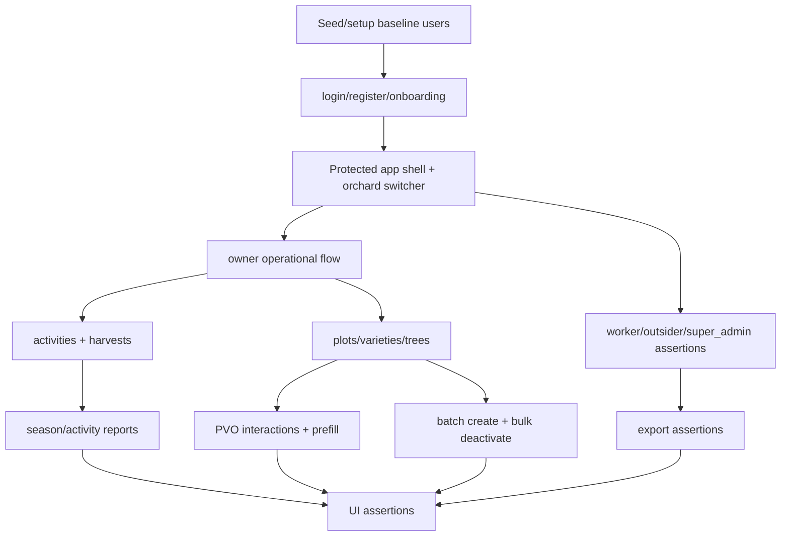

# 15 E2E Coverage Map

Playwright E2E coverage for routes, roles, and user flows.

## Sources Inspected

- `package.json`
- `playwright.config.ts`
- `tests/e2e/*`
- `tests/e2e/support/*`
- `tests/helpers/*`
- `scripts/*baseline*.mjs`
- `app/`

`documents/archive/` was not used as source of truth.

## Test Commands

| Command | Purpose | Notes |
| ------- | ------- | ----- |
| `pnpm test` | Runs Vitest unit/integration/security suites | Excludes `tests/e2e/**`. |
| `pnpm test:watch` | Runs Vitest in watch mode | Local development only. |
| `pnpm test:e2e` | Runs Playwright E2E tests | Uses `playwright.config.ts`; starts/reuses `pnpm dev`. |
| `pnpm test:e2e:headed` | Runs Playwright in headed mode | Useful for manual browser inspection. |
| `pnpm test:e2e:install` | Installs Chromium browser | `playwright install chromium`. |
| `pnpm seed:baseline-users` | Bootstraps baseline auth users | Supports seeded E2E/manual QA. |
| `pnpm seed:baseline-sql` | Runs SQL baseline seed | Uses `supabase/seeds/001_baseline_reference_seed.sql`. |
| `pnpm seed:baseline-reset` | Resets and seeds local baseline | Recommended before manual seeded QA. |
| `pnpm qa:baseline-status` | Checks baseline readiness | Reports seeded dataset status. |
| `pnpm typecheck` | TypeScript gate | Not E2E-specific. |
| `pnpm lint` | ESLint gate | Not E2E-specific. |

Playwright configuration:

- `testDir: "./tests/e2e"`
- one Chromium project
- `fullyParallel: false`, `workers: 1`
- `baseURL` from `NEXT_PUBLIC_APP_URL` or `http://localhost:3000`
- web server command: `pnpm dev --hostname 127.0.0.1 --port 3000`

## Route Coverage Matrix

| Route | Feature | Role(s) tested | Flow covered | E2E test file(s) | Gaps |
| ----- | ------- | -------------- | ------------ | ---------------- | ---- |
| `/` | root decision route | owner, worker, outsider, super_admin, fresh user | post-login redirects to dashboard/profile/onboarding | `auth-onboarding.spec.ts`, `orchard-access.spec.ts` | Direct unauthenticated root redirect not explicitly asserted. |
| `/login` | auth | all seeded users through helpers | login as setup for flows | all E2E via support helpers | Standalone login form error states not covered. |
| `/register` | auth | fresh user | register account | `auth-onboarding.spec.ts` | Negative validation not E2E. |
| `/reset-password` | auth | none | none | none found | Reset request/completion not covered by E2E. |
| `/bootstrap-error` | profile recovery | none | none | none found | Integration covers profile bootstrap; no browser route test. |
| `/orchards/new` | onboarding | fresh user, outsider redirect | first orchard creation; outsider denied operational route and sent to onboarding | `auth-onboarding.spec.ts`, `orchard-access.spec.ts` | Additional orchard creation from existing user unclear in E2E. |
| `/dashboard` | app home | owner, worker | dashboard after login, upcoming activities | `auth-onboarding.spec.ts`, `orchard-access.spec.ts`, `owner-operational-flow.spec.ts` | No visual snapshot baseline. |
| `/plots` | plots list | owner | list, filter reset via auth onboarding, open PVO | `auth-onboarding.spec.ts`, `plot-visual-operations.spec.ts` | Worker plot list not explicit. |
| `/plots/new` | plot create | owner | create plot in multiple flows | `auth-onboarding.spec.ts`, `orchard-access.spec.ts`, `owner-operational-flow.spec.ts`, `tree-batch-and-export.spec.ts`, `plot-visual-operations.spec.ts` | Validation/error states not E2E. |
| `/plots/[plotId]` | PVO | owner | rows/mixed/irregular, filters, browse/select, prefill links | `plot-visual-operations.spec.ts` | Worker PVO not explicit; no harvest entrypoint because not implemented. |
| `/plots/[plotId]/edit` | plot edit | none explicit | none found | none found | Covered by integration, not E2E. |
| `/varieties` | variety list/search | owner | visible after create in operational flow | `owner-operational-flow.spec.ts`, `tree-batch-and-export.spec.ts` | Search/filter not explicitly E2E. |
| `/varieties/new` | variety create | owner | create variety | `owner-operational-flow.spec.ts`, `tree-batch-and-export.spec.ts` | Edit route not E2E. |
| `/varieties/[varietyId]/edit` | variety edit | none explicit | none found | none found | Integration only. |
| `/trees` | tree list/filter | owner | search/filter after create/bulk deactivate | `owner-operational-flow.spec.ts`, `tree-batch-and-export.spec.ts` | Worker route not explicit. |
| `/trees/new` | tree create | owner | create tree; PVO prefill prerequisite route path touched | `owner-operational-flow.spec.ts`, `plot-visual-operations.spec.ts` | Edit route not directly submitted in E2E. |
| `/trees/[treeId]/edit` | tree edit | owner | PVO validates edit link href | `plot-visual-operations.spec.ts` | No edit submit E2E. |
| `/trees/batch/new` | batch tree create | owner | preview/confirm and PVO prefill | `tree-batch-and-export.spec.ts`, `plot-visual-operations.spec.ts` | Worker batch flow only security/integration, not E2E. |
| `/trees/batch/deactivate` | bulk tree deactivate | owner | preview/confirm and PVO prefill | `tree-batch-and-export.spec.ts`, `plot-visual-operations.spec.ts` | Worker batch flow only security/integration, not E2E. |
| `/activities` | activity list/report panel | owner | detail navigation, seasonal summary/coverage | `owner-operational-flow.spec.ts` | Full list filters not E2E. |
| `/activities/new` | activity create | owner | create pruning/spraying/planned; PVO prefill | `owner-operational-flow.spec.ts`, `orchard-access.spec.ts`, `plot-visual-operations.spec.ts` | Worker create not E2E. |
| `/activities/[activityId]` | activity detail | owner | detail read and record-not-found recovery | `owner-operational-flow.spec.ts`, `orchard-access.spec.ts` | Status/delete not explicit E2E. |
| `/activities/[activityId]/edit` | activity edit | none explicit | none found | none found | Integration covers update. |
| `/harvests` | harvest list | owner | list reached through flow | `owner-operational-flow.spec.ts` | Filters not explicit E2E. |
| `/harvests/new` | harvest create | owner | create harvest linked to operational data | `owner-operational-flow.spec.ts` | All scope levels not browser-covered. |
| `/harvests/[harvestRecordId]` | harvest detail | none explicit | unclear from E2E | `owner-operational-flow.spec.ts` indirectly may not assert detail route | Add direct detail/read E2E if needed. |
| `/harvests/[harvestRecordId]/edit` | harvest edit | none explicit | none found | none found | Integration covers update. |
| `/reports/season-summary` | harvest report | owner, outsider denial | summary filters and outsider redirect/denial | `owner-operational-flow.spec.ts`, `orchard-access.spec.ts` | Worker report access not explicit. |
| `/reports/harvest-locations` | harvest location report | none explicit | none found | none found | Integration only. |
| `/reports/variety-locations` | variety location report | owner | report after batch/export flow | `tree-batch-and-export.spec.ts` | Filter edge cases mostly unit/integration. |
| `/settings/orchard` | orchard settings | none explicit | none found | none found | Integration/unit covers owner/worker behavior. |
| `/settings/members` | members management | worker denial | worker sees access denied | `orchard-access.spec.ts` | Owner invite/removal not E2E. |
| `/settings/profile` | profile/export | worker, super_admin | worker forbidden export, super_admin export | `orchard-access.spec.ts` | Owner export covered via route in batch/export; profile update not E2E. |
| `GET /auth/sync-active-orchard` | active orchard cookie sync | owner | exercised through switcher | `orchard-access.spec.ts` | Direct invalid orchardId route handler not E2E. |
| `GET /settings/profile/export` | export | worker, owner, super_admin | worker 403; owner/super_admin 200 | `orchard-access.spec.ts`, `tree-batch-and-export.spec.ts` | Export payload details mostly integration. |
| `GET /favicon.ico` | favicon | none | none | none | No meaningful E2E needed. |

## Role Coverage Matrix

| Role | Covered by E2E? | Covered by security/integration tests? | Main test files | Missing coverage |
| ---- | --------------- | -------------------------------------- | --------------- | ---------------- |
| unauthenticated | Partial | Partial | Auth redirect behavior via layouts/helpers; auth E2E starts unauthenticated | Direct unauthenticated access assertions for every protected route are not present. |
| outsider | Yes | Yes | `orchard-access.spec.ts`, `orchard-rls.spec.ts` | Only representative operational denial route is covered in E2E. |
| worker | Yes | Yes | `orchard-access.spec.ts`, `tests/security/*` | Worker operational create/update is integration/security, not browser E2E. |
| owner | Yes | Yes | all E2E except super_admin-specific; integration/security suites | Owner settings/member invite/removal not fully browser-covered. |
| super_admin | Yes | Yes | `orchard-access.spec.ts`, `account-export.spec.ts`, RLS helper coverage | Operational app without active orchard intentionally redirects to profile; deeper admin UI is limited. |

## Flow Coverage Matrix

| Flow | E2E status | Test files | Notes/gaps |
| ---- | ---------- | ---------- | ---------- |
| login/register/onboarding | Covered | `auth-onboarding.spec.ts` | Reset-password completion missing. |
| active orchard switching | Covered | `orchard-access.spec.ts` | Invalid switch target covered by unit action test, not browser. |
| owner operational flow | Covered | `owner-operational-flow.spec.ts` | Broad smoke flow for plot/variety/tree/activity/harvest/report. |
| worker operational flow | Partial | `orchard-access.spec.ts` | Browser covers restrictions/export, not worker operational writes. |
| outsider denial | Covered | `orchard-access.spec.ts` | Representative report route only. |
| plot CRUD | Partial | `auth-onboarding.spec.ts`, `owner-operational-flow.spec.ts` | Create covered; edit/archive/restore integration only. |
| PVO interactions | Covered | `plot-visual-operations.spec.ts` | Strongest E2E area; no harvest entrypoint because feature missing. |
| variety CRUD/search | Partial | `owner-operational-flow.spec.ts`, `tree-batch-and-export.spec.ts` | Create covered; edit/search mostly integration/unit. |
| tree CRUD/filtering | Partial | `owner-operational-flow.spec.ts`, `tree-batch-and-export.spec.ts` | Create/filter covered; edit submit not E2E. |
| batch tree create | Covered | `tree-batch-and-export.spec.ts`, `plot-visual-operations.spec.ts` | Owner only in E2E. |
| bulk tree deactivate | Covered | `tree-batch-and-export.spec.ts`, `plot-visual-operations.spec.ts` | Owner only in E2E. |
| activity CRUD/status/scopes/materials | Partial | `owner-operational-flow.spec.ts`, `plot-visual-operations.spec.ts` | Create/detail/scopes covered; edit/status/delete integration only. |
| harvest CRUD/scope levels | Partial | `owner-operational-flow.spec.ts` | Create/report covered; all scope levels integration/unit. |
| reports | Partial | `owner-operational-flow.spec.ts`, `tree-batch-and-export.spec.ts`, `orchard-access.spec.ts` | `harvest-locations` lacks direct E2E. |
| member invite/removal | Partial | `orchard-access.spec.ts` | Worker denial E2E; owner invite/removal integration/unit. |
| owner export | Covered | `tree-batch-and-export.spec.ts` | Payload depth integration-tested. |
| super_admin export | Covered | `orchard-access.spec.ts` | Good representative coverage. |

## Mermaid Summary

## Gaps And Recommendations

1. Add E2E for owner member invite and member removal on `/settings/members`.
2. Add E2E for `/settings/orchard` owner update and worker denial if UI is important.
3. Add E2E for worker operational writes, or explicitly document that integration/security coverage is enough.
4. Add direct E2E for `/reports/harvest-locations`.
5. Add edit-submit E2E for plot, variety, tree, activity and harvest only if regression risk justifies browser cost.
6. Add reset-password request browser test; set-new-password callback remains unimplemented.
7. Add direct unauthenticated protected-route redirect smoke test if auth boundary regressions become common.
8. Add route-root `data-testid` attributes for easier AI/Playwright visual inspection across all major pages.

## Repository References

- `package.json`
- `playwright.config.ts`
- `tests/e2e/auth-onboarding.spec.ts`
- `tests/e2e/orchard-access.spec.ts`
- `tests/e2e/owner-operational-flow.spec.ts`
- `tests/e2e/plot-visual-operations.spec.ts`
- `tests/e2e/tree-batch-and-export.spec.ts`
- `tests/e2e/support/*`
- `scripts/reset-and-seed-baseline.mjs`
- `scripts/check-baseline-qa-status.mjs`
- `app/`
